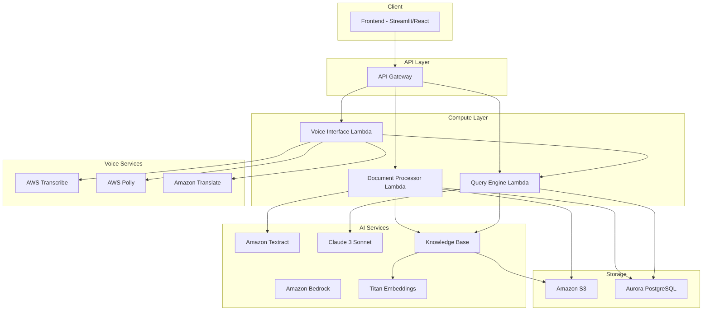

# Design Document: Jansahayak

## Domain: AI for Rural Innovation and Sustainable Systems

This solution addresses the critical challenge of information accessibility in rural India, where citizens often struggle to understand government welfare schemes due to language barriers and complex bureaucratic language. By leveraging GenAI with multilingual voice interfaces, Jansahayak democratizes access to government benefits, supporting sustainable rural development and inclusive governance.

## Overview

Jansahayak is a serverless backend system built on AWS that enables Indian citizens to query government scheme documents using voice in regional languages. The system combines OCR-based document processing, RAG (Retrieval-Augmented Generation) with Amazon Bedrock, and multilingual voice interfaces to provide accessible, fact-checked responses with source citations.

The architecture follows a modular design with clear separation between document processing, query handling, and voice interfaces, all deployed as AWS Lambda functions behind API Gateway.

### Key Impact Areas
- **Rural Accessibility**: Voice-first interface removes literacy barriers
- **Language Inclusion**: Support for Hindi, Telugu, Tamil enables regional access
- **Trust & Transparency**: Citation-based responses prevent misinformation
- **Sustainable Governance**: Reduces dependency on intermediaries for scheme information

## Architecture



## Components and Interfaces

### 1. Document Processor Component

Handles document upload, OCR extraction, chunking, and Knowledge Base ingestion.

```python
from dataclasses import dataclass
from enum import Enum
from typing import List, Optional
from datetime import datetime

class DocumentStatus(Enum):
    PENDING = "pending"
    PROCESSING = "processing"
    COMPLETED = "completed"
    FAILED = "failed"

@dataclass
class DocumentChunk:
    chunk_id: str
    document_id: str
    content: str
    page_number: int
    section_reference: Optional[str]
    start_char: int
    end_char: int

@dataclass
class DocumentMetadata:
    document_id: str
    filename: str
    s3_key: str
    upload_date: datetime
    status: DocumentStatus
    chunk_count: int
    file_size_bytes: int
    mime_type: str
    error_message: Optional[str] = None

class DocumentProcessor:
    """Processes uploaded documents through OCR and chunking pipeline."""
    
    async def upload_document(self, file_content: bytes, filename: str, mime_type: str) -> DocumentMetadata:
        """
        Upload and process a document.
        
        Args:
            file_content: Raw file bytes
            filename: Original filename
            mime_type: MIME type (application/pdf, image/png, etc.)
            
        Returns:
            DocumentMetadata with processing status
            
        Raises:
            FileTooLargeError: If file exceeds 50MB limit
            UnsupportedFormatError: If file type not supported
        """
        pass
    
    async def extract_text(self, s3_key: str, mime_type: str) -> str:
        """Extract text from document using Amazon Textract."""
        pass
    
    def chunk_text(self, text: str, document_id: str) -> List[DocumentChunk]:
        """
        Split text into semantically meaningful chunks.
        
        Uses recursive character splitting with overlap to maintain context.
        Target chunk size: 1000 characters with 200 character overlap.
        """
        pass
    
    async def ingest_to_knowledge_base(self, chunks: List[DocumentChunk]) -> bool:
        """Store chunks in Amazon Bedrock Knowledge Base with Titan embeddings."""
        pass
    
    async def get_document_status(self, document_id: str) -> DocumentMetadata:
        """Retrieve current processing status of a document."""
        pass
    
    async def delete_document(self, document_id: str) -> bool:
        """Remove document from S3, Aurora, and Knowledge Base."""
        pass
```

### 2. Query Engine Component

Handles semantic search and LLM-based response generation with citations.

```python
from dataclasses import dataclass
from typing import List, Optional

@dataclass
class Citation:
    document_id: str
    document_name: str
    page_number: int
    clause_reference: str
    excerpt: str
    confidence_score: float

@dataclass
class QueryResult:
    answer: str
    citations: List[Citation]
    query_id: str
    processing_time_ms: int

@dataclass
class RetrievedChunk:
    chunk_id: str
    document_id: str
    content: str
    relevance_score: float
    page_number: int
    section_reference: Optional[str]

class QueryEngine:
    """Processes user queries against the Knowledge Base."""
    
    async def query(self, query_text: str, language: str = "en") -> QueryResult:
        """
        Process a text query and return cited response.
        
        Args:
            query_text: User's question in English
            language: Target response language code
            
        Returns:
            QueryResult with answer and citations
        """
        pass
    
    async def retrieve_relevant_chunks(self, query_text: str, top_k: int = 5) -> List[RetrievedChunk]:
        """
        Perform semantic search against Knowledge Base.
        
        Uses Titan embeddings to find most relevant document chunks.
        """
        pass
    
    async def generate_response(self, query: str, context_chunks: List[RetrievedChunk]) -> tuple[str, List[Citation]]:
        """
        Generate LLM response with citations using Claude 3 Sonnet.
        
        The prompt instructs Claude to:
        1. Only use information from provided context
        2. Cite specific sections for each claim
        3. Indicate when information is not available
        """
        pass
    
    def extract_citations(self, llm_response: str, chunks: List[RetrievedChunk]) -> List[Citation]:
        """Parse LLM response to extract structured citations."""
        pass
```

### 3. Voice Interface Component

Handles speech-to-text, translation, and text-to-speech for multilingual support.

```python
from dataclasses import dataclass
from enum import Enum
from typing import Optional

class SupportedLanguage(Enum):
    HINDI = "hi"
    TELUGU = "te"
    TAMIL = "ta"
    ENGLISH = "en"

@dataclass
class TranscriptionResult:
    text: str
    language: SupportedLanguage
    confidence: float

@dataclass
class VoiceQueryResult:
    transcribed_text: str
    translated_query: str
    answer_text: str
    translated_answer: str
    audio_url: str
    citations: List[Citation]

class VoiceInterface:
    """Handles multilingual voice input and output."""
    
    async def transcribe_audio(self, audio_bytes: bytes, language: SupportedLanguage) -> TranscriptionResult:
        """
        Transcribe audio to text using AWS Transcribe.
        
        Args:
            audio_bytes: Audio file content (WAV, MP3, or FLAC)
            language: Expected language of the audio
            
        Returns:
            TranscriptionResult with text and confidence
            
        Raises:
            TranscriptionError: If audio quality too poor or service unavailable
        """
        pass
    
    async def translate_to_english(self, text: str, source_language: SupportedLanguage) -> str:
        """Translate regional language text to English using Amazon Translate."""
        pass
    
    async def translate_from_english(self, text: str, target_language: SupportedLanguage) -> str:
        """Translate English text to regional language using Amazon Translate."""
        pass
    
    async def synthesize_speech(self, text: str, language: SupportedLanguage) -> bytes:
        """
        Convert text to speech using AWS Polly.
        
        Uses neural voices for supported languages:
        - Hindi: Aditi (neural)
        - Telugu: Standard voice
        - Tamil: Standard voice
        """
        pass
    
    async def process_voice_query(self, audio_bytes: bytes, language: SupportedLanguage) -> VoiceQueryResult:
        """
        End-to-end voice query processing.
        
        Pipeline:
        1. Transcribe audio to text
        2. Translate to English (if not English)
        3. Query the Knowledge Base
        4. Translate response to user's language
        5. Synthesize speech
        """
        pass
```

### 4. API Layer

FastAPI application exposing REST endpoints.

```python
from fastapi import FastAPI, UploadFile, HTTPException
from pydantic import BaseModel
from typing import List, Optional

app = FastAPI(title="Jansahayak API", version="1.0.0")

class TextQueryRequest(BaseModel):
    query: str
    language: str = "en"

class VoiceQueryRequest(BaseModel):
    language: str  # hi, te, ta, en

class DocumentResponse(BaseModel):
    document_id: str
    filename: str
    status: str
    upload_date: str
    chunk_count: Optional[int]

class QueryResponse(BaseModel):
    answer: str
    citations: List[dict]
    processing_time_ms: int

class VoiceQueryResponse(BaseModel):
    transcribed_text: str
    answer_text: str
    audio_url: str
    citations: List[dict]

# Endpoints defined per Requirement 6
# POST /documents/upload
# POST /query/text
# POST /query/voice
# GET /documents
# GET /documents/{id}/status
```

## Data Models

### Aurora PostgreSQL Schema

```sql
-- Documents table
CREATE TABLE documents (
    document_id UUID PRIMARY KEY DEFAULT gen_random_uuid(),
    filename VARCHAR(255) NOT NULL,
    s3_key VARCHAR(512) NOT NULL UNIQUE,
    mime_type VARCHAR(100) NOT NULL,
    file_size_bytes BIGINT NOT NULL,
    status VARCHAR(20) NOT NULL DEFAULT 'pending',
    chunk_count INTEGER,
    error_message TEXT,
    created_at TIMESTAMP WITH TIME ZONE DEFAULT NOW(),
    updated_at TIMESTAMP WITH TIME ZONE DEFAULT NOW(),
    
    CONSTRAINT valid_status CHECK (status IN ('pending', 'processing', 'completed', 'failed'))
);

-- Document chunks table (for citation lookup)
CREATE TABLE document_chunks (
    chunk_id UUID PRIMARY KEY DEFAULT gen_random_uuid(),
    document_id UUID NOT NULL REFERENCES documents(document_id) ON DELETE CASCADE,
    content TEXT NOT NULL,
    page_number INTEGER NOT NULL,
    section_reference VARCHAR(255),
    start_char INTEGER NOT NULL,
    end_char INTEGER NOT NULL,
    knowledge_base_id VARCHAR(255),
    created_at TIMESTAMP WITH TIME ZONE DEFAULT NOW(),
    
    INDEX idx_chunks_document (document_id),
    INDEX idx_chunks_kb (knowledge_base_id)
);

-- Query audit log
CREATE TABLE query_logs (
    query_id UUID PRIMARY KEY DEFAULT gen_random_uuid(),
    query_text TEXT NOT NULL,
    source_language VARCHAR(10),
    response_text TEXT,
    processing_time_ms INTEGER,
    created_at TIMESTAMP WITH TIME ZONE DEFAULT NOW()
);
```

### S3 Structure

```
jansahayak-documents/
├── raw/
│   └── {document_id}/{filename}
├── processed/
│   └── {document_id}/extracted_text.json
└── audio/
    └── {query_id}/response.mp3
```


## Correctness Properties

*A property is a characteristic or behavior that should hold true across all valid executions of a system—essentially, a formal statement about what the system should do. Properties serve as the bridge between human-readable specifications and machine-verifiable correctness guarantees.*

### Property 1: Document Text Extraction

*For any* valid PDF or image file (PNG, JPG, JPEG) containing text, the Document_Processor SHALL extract non-empty text content that preserves the document's paragraph structure.

**Validates: Requirements 1.1, 1.2, 1.3**

### Property 2: Text Chunking Consistency

*For any* non-empty text input, the chunking function SHALL produce chunks where:
- Each chunk is at most 1000 characters
- Consecutive chunks have at least 200 characters of overlap
- The concatenation of all chunks (minus overlaps) reconstructs the original text

**Validates: Requirements 1.4**

### Property 3: Document Persistence Round-Trip

*For any* successfully uploaded document, retrieving the document by its ID SHALL return:
- The original file content from S3 (byte-for-byte identical)
- Complete metadata from Aurora (filename, upload date, status, chunk count)

**Validates: Requirements 1.8, 7.1, 7.2**

### Property 4: Translation Round-Trip Consistency

*For any* text in a supported regional language (Hindi, Telugu, Tamil), translating to English and back to the original language SHALL preserve the semantic meaning (measured by embedding similarity > 0.85).

**Validates: Requirements 2.4, 5.4**

### Property 5: Query Response Grounding

*For any* query response generated by the Query_Engine, every factual claim in the response SHALL be traceable to a specific chunk in the retrieved context. Claims without source attribution SHALL be excluded from the response.

**Validates: Requirements 3.3, 4.4**

### Property 6: Citation Completeness

*For any* LLM response containing factual claims, the Citation_Extractor SHALL produce citations where each citation contains:
- Document ID and name
- Page number
- Clause/section reference
- Relevant excerpt
- Confidence score between 0 and 1

**Validates: Requirements 4.1, 4.2, 4.3, 4.5**

### Property 7: Document Deletion Completeness

*For any* document that is deleted, querying for that document SHALL return not-found from:
- S3 (original file)
- Aurora (metadata record)
- Knowledge Base (all associated chunks)

**Validates: Requirements 7.3**

### Property 8: Storage Referential Integrity

*For any* document in the system, the following invariant SHALL hold:
- If a document exists in Aurora, its S3 object exists
- If a document has chunks in Aurora, those chunks exist in the Knowledge Base
- If a document is in "completed" status, chunk_count > 0

**Validates: Requirements 7.4**

### Property 9: API Input Validation

*For any* API request with invalid input (missing required fields, wrong types, out-of-range values), the API SHALL return HTTP 400 with a descriptive error message that does not expose internal implementation details.

**Validates: Requirements 6.6, 6.7, 8.4**

### Property 10: Error Logging Without Exposure

*For any* error that occurs during request processing:
- The error details SHALL be logged with sufficient context for debugging
- The user-facing response SHALL NOT contain stack traces, internal paths, or service names

**Validates: Requirements 8.3, 8.4**

## Error Handling

### Error Categories

| Category | HTTP Status | User Message | Logging |
|----------|-------------|--------------|---------|
| Invalid Input | 400 | Specific validation error | Debug level |
| File Too Large | 413 | "File exceeds 50MB limit" | Info level |
| Unsupported Format | 415 | "Unsupported file type" | Info level |
| Document Not Found | 404 | "Document not found" | Debug level |
| Transcription Failed | 422 | "Could not transcribe audio. Please try again with clearer audio." | Warning level |
| Service Unavailable | 503 | "Service temporarily unavailable. Please try again." | Error level |
| Internal Error | 500 | "An unexpected error occurred" | Error level with stack trace |

### Retry Strategy

```python
RETRY_CONFIG = {
    "max_retries": 3,
    "base_delay_seconds": 1,
    "max_delay_seconds": 30,
    "exponential_base": 2,
    "retryable_exceptions": [
        "ThrottlingException",
        "ServiceUnavailableException",
        "InternalServerException"
    ]
}
```

### Circuit Breaker Pattern

For AWS service calls, implement circuit breaker with:
- Failure threshold: 5 failures in 60 seconds
- Recovery timeout: 30 seconds
- Half-open state: Allow 1 request to test recovery

## Testing Strategy

### Dual Testing Approach

This system requires both unit tests and property-based tests for comprehensive coverage:

- **Unit tests**: Verify specific examples, edge cases, and error conditions
- **Property-based tests**: Verify universal properties across all valid inputs

### Property-Based Testing Framework

**Framework**: Hypothesis (Python)

**Configuration**:
```python
from hypothesis import settings, Phase

settings.register_profile(
    "ci",
    max_examples=100,
    phases=[Phase.generate, Phase.target, Phase.shrink]
)
```

### Test Categories

#### Unit Tests
- API endpoint routing and response formats
- Error message formatting
- Configuration loading
- Individual AWS service client initialization

#### Property-Based Tests
Each correctness property maps to a property-based test:

| Property | Test File | Generator Strategy |
|----------|-----------|-------------------|
| Property 1: Document Text Extraction | `test_document_processor.py` | Generate valid PDF/image bytes with known text |
| Property 2: Text Chunking | `test_chunking.py` | Generate random text strings of varying lengths |
| Property 3: Document Persistence | `test_storage.py` | Generate document metadata and file content |
| Property 4: Translation Round-Trip | `test_translation.py` | Generate text in supported languages |
| Property 5: Query Grounding | `test_query_engine.py` | Generate queries and context chunks |
| Property 6: Citation Completeness | `test_citations.py` | Generate LLM responses with claims |
| Property 7: Deletion Completeness | `test_deletion.py` | Generate document IDs |
| Property 8: Referential Integrity | `test_integrity.py` | Generate system states |
| Property 9: API Validation | `test_api_validation.py` | Generate invalid request payloads |
| Property 10: Error Logging | `test_error_handling.py` | Generate error scenarios |

#### Integration Tests
- End-to-end document upload and query flow
- Voice query pipeline with mocked AWS services
- Multi-language translation pipeline

### Test Annotation Format

Each property test must include:
```python
@given(...)
@settings(max_examples=100)
def test_property_name(self, ...):
    """
    Feature: jansahayak, Property N: [Property Title]
    Validates: Requirements X.Y, X.Z
    """
    pass
```
